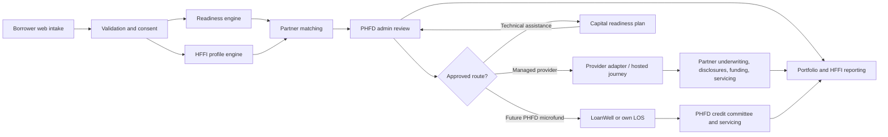

# PHFD Capital
## Product and Technical Design Document

**Version:** 0.1 MVP  
**Prepared for:** Park Hill Financial District  
**Primary launch market:** Colorado business-purpose financing  
**First vertical:** PHFD Food Capital  
**Operating posture:** Sandbox-first, human-reviewed, provider-integrated

---

## 1. Executive decision

PHFD Capital launches as a **capital-readiness, intake, triage, partner-routing, and portfolio-intelligence platform**. It does not represent itself as a lender in the MVP.

The fastest lawful operating model is:

1. PHFD owns the brand, education, community acquisition, initial business profile, readiness workflow, and relationship.
2. A contracted embedded-capital provider or licensed lender owns the regulated origination functions assigned in the agreement, including final underwriting, disclosures, funding, servicing, collections, and adverse-action notices where applicable.
3. PHFD builds a separate business-purpose microfund only after legal review, capital, lending authority, credit policies, servicing capability, and compliance controls are established.
4. PHFD uses the resulting systems, staff allocation, transaction records, development services, target-market data, and governance structure as part of a long-term CDFI certification path.

This structure creates speed without pretending the legal and capital layers already exist.

---

## 2. Problem

Community businesses face a fragmented capital journey:

- Repeated applications across lenders
- Opaque declines
- Weak preparation before underwriting
- Products disconnected from business cash flow
- Poor access for newer, BIPOC-owned, women-owned, neighborhood, and food-system businesses
- No shared pipeline intelligence for public, philanthropic, and lending partners

PHFD Capital becomes the operating layer between entrepreneurs and capital providers.

---

## 3. Users

### Borrower / business owner

Creates a business profile, reviews readiness, completes technical assistance, gives explicit data-sharing consent, and enters a matched capital route.

### PHFD capital navigator

Reviews documents, validates data, coaches the applicant, resolves readiness gaps, selects partner routes, and records activity.

### Credit or referral manager

Controls partner submissions, documents human review, monitors status, and manages the provider relationship.

### Capital partner

Receives consented data through its approved intake/API process and performs the functions assigned under the commercial and compliance agreement.

### HFFI / food-finance program manager

Tracks eligible food-retail and post-harvest supply-chain pipeline, target geographies, technical assistance, leverage, square footage, jobs, and capital outcomes.

---

## 4. Product layers

### Layer 1: Capital readiness

- Structured business intake
- Monthly revenue, expenses, cash, existing debt, NSFs, and operating history
- Requested amount and use of proceeds
- Document-readiness checklist
- Training completion status
- Applicant-controlled data consent

### Layer 2: Explainable underwriting assistance

The MVP calculates a **non-binding Capital Readiness Score** using business-purpose factors:

- Operating history
- Stress-tested cash-flow coverage
- Requested amount relative to revenue
- Liquidity
- NSF pattern
- Revenue stability
- Document completeness
- Training completion

The score returns:

- Partner-ready
- Manual review
- Capital readiness

It never returns an approval or denial. It provides specific strengths and review reasons so the human navigator can act.

### Layer 3: Partner routing

Initial routes:

- YouLend: managed embedded capital / fast pilot candidate
- Lendflow: multi-lender white-label marketplace
- Kanmon: full-stack capital where PHFD has useful transaction, payment, invoice, or supply-chain data
- Parafin: later-stage platform-scale embedded capital
- LoanWell: future PHFD-owned loan-fund operating system

### Layer 4: Human review

- Status management
- Reviewer notes
- Consent validation
- Mock/live provider submission control
- Audit events
- Referral accountability

### Layer 5: Portfolio intelligence

- Number of applications
- Capital requested
- Average readiness score
- HFFI-aligned pipeline
- Status distribution
- Partner conversion
- Geography
- Product demand
- Export for reporting and grant strategy

---

## 5. PHFD Food Capital

PHFD Food Capital is a vertical within the broader platform. It is designed around a **Food Financing Program**, not one grocery store.

Target businesses include:

- Grocery stores
- Food cooperatives
- Healthy-food retailers
- SNAP-authorized mobile markets
- Food hubs
- Aggregators
- Distributors
- Processors and manufacturers that increase downstream staple/perishable food access
- Cold storage and last-mile distribution infrastructure

The MVP screens for key HFFI concepts:

- Underserved-area status
- SNAP status or documented plan
- Staple-food assortment
- Perishable-food access
- Downstream distribution to eligible SNAP retailers
- Ineligible primary models such as free charitable food, pre-harvest farming, prepared-food-only businesses, standalone kitchens, and narrow packaged-goods businesses

The output is a profile screen, not an official eligibility determination.

### HFFI alignment

The 2026 HFFI Partnerships RFA allows capacity-building support for program personnel, community surveys, data analysis, financial-product development, lender recruitment, technical assistance, business development, outreach, software/program materials, training, legal work, tax/accounting support, and related operating costs. The platform is intentionally designed around those functions.

The Partnerships Program does not fund an application centered on one grocery store or mobile market. The platform therefore treats the grocery co-op as a future pipeline project within a multi-project financing program.

---

## 6. System architecture

### Current MVP stack

- FastAPI
- Jinja2 server-rendered interface
- SQLite for local/sandbox use
- Explainable Python rules engine
- Provider adapter pattern
- HTTP Basic admin protection
- CSV export
- Audit-event log

### Production target stack

- FastAPI API service
- PostgreSQL with row-level controls
- Object storage for encrypted documents
- Managed secrets vault
- OAuth/OIDC authentication with MFA
- Role-based access control
- KMS-backed field encryption
- Provider webhooks and idempotency controls
- Observability and incident logging
- Background worker for partner status synchronization
- Data warehouse or BI layer for HFFI reporting

---

## 7. Current data model

### Applications

Identity and contact, business profile, operating metrics, requested capital, HFFI screening inputs, readiness outputs, partner matches, submission log, status, and reviewer notes.

### Partners

Provider category, priority, commercial status, contact details, fit summary, diligence notes, and next action.

### Audit events

Application created, status updated, provider submission prepared, actor, timestamp, and structured detail.

### Production additions

- Applicant organization and beneficial-owner records
- Consent versions and timestamps
- Secure document metadata
- Provider IDs
- Disclosure acknowledgements
- Decision and adverse-action ownership
- Offer and funding records
- Repayment and servicing events
- Technical-assistance sessions
- HFFI target-market/location verification
- Outcome metrics

---

## 8. API surface

### Public

- `GET /health`
- `GET /`
- `GET /apply`
- `POST /apply`
- `GET /result/{application_id}`
- `POST /api/v1/assess`

### Admin

- `GET /admin`
- `GET /admin/applications/{application_id}`
- `POST /admin/applications/{application_id}/status`
- `POST /admin/applications/{application_id}/submit/{provider}`
- `GET /admin/partners`
- `POST /admin/partners/{provider}/status`
- `GET /admin/export.csv`

### Provider architecture

`CapitalProvider.submit(application)` provides one consistent internal interface.

Default provider behavior is a sandbox mock that creates an external reference without transmitting applicant data. A YouLend adapter scaffold is included, but live mode requires credentials, a signed agreement, production-grade data controls, and all required U.S. fields.

---

## 9. Provider strategy

### Priority 1: YouLend

Use case: quickest provider-hosted or embedded pilot where YouLend supplies capital and the regulated operating stack.

Ask:

- Can PHFD qualify as a community platform, broker channel, or technology partner?
- What minimum merchant/customer count is required?
- Which U.S. states and business types are supported?
- What applicant and payment/bank data is required?
- Who owns marketing review, underwriting, disclosures, adverse action, complaints, servicing, and collections?
- What is the revenue-share model?
- Can the initial pilot use a co-branded/no-code journey before API integration?

### Priority 2: Lendflow

Use case: broad product marketplace and second-look routing across multiple lenders.

Ask:

- Managed, direct-contract, or hybrid lender model
- Colorado product coverage
- Full-white-label depth
- Lender waterfall design
- Decline and adverse-action responsibility
- Pricing, revenue share, implementation fee, minimum volume, and exclusivity
- Data retention and applicant consent architecture

### Priority 3: Kanmon

Use case: best when PHFD controls recurring transaction, invoice, ordering, payment, or distribution data for business customers.

Ask:

- Minimum active business customer base
- Required recurring data signals
- Food/distribution vertical appetite
- Economics and pilot threshold
- Underwriting ownership and partner visibility

### Priority 4: LoanWell

Use case: operating system for a future PHFD-controlled microloan fund or CDFI lending arm.

Ask:

- Startup/community lender package
- Intake, KYC, credit, e-sign, ACH, servicing, and reporting pricing
- Data migration and ownership
- Business-purpose disclosures
- CDFI reporting support
- Implementation and support model

### Priority 5: Parafin

Use case: later-stage embedded capital after PHFD develops meaningful customer scale and payments/transaction volume.

---

## 10. Compliance design

### Product boundary

The MVP is limited to business-purpose capital readiness and referrals. Consumer/personal loans are not offered.

### Human-in-the-loop

- The score cannot approve or deny credit.
- It cannot use race, color, religion, national origin, sex, marital status, age, public-assistance status, or proxies for protected traits.
- A reviewer controls referrals.
- A contracted lender controls final credit decisioning unless PHFD later becomes legally authorized and operationally ready to lend.

### Reason codes

The rules engine generates specific business reasons such as limited operating history, weak cash-flow coverage, high request-to-revenue, low liquidity, recent NSFs, high volatility, or incomplete documents. These are readiness reasons, not formal adverse-action notices.

### Consent

Separate consent is captured for:

- Willingness to connect bank/payment data in a future secure flow
- Permission to share the business profile with selected partners after human review

Production consent must be versioned, timestamped, purpose-limited, revocable where required, and tied to the actual privacy notice.

### Data minimization

The MVP intentionally does not collect SSNs, dates of birth, owner KYC documents, bank credentials, or full tax IDs. Those should be collected through the contracted provider's secure embedded journey or a production system with appropriate encryption and access controls.

### Legal gate

Before live launch, Colorado lending counsel must review:

- Broker/referral/licensing implications
- Compensation and lead-generation structure
- Business-purpose product disclosures
- ECOA/Regulation B allocation
- FCRA/permissible-purpose controls where credit is pulled
- UDAAP and marketing claims
- Privacy/data-processing agreements
- E-signature and records
- Servicing/collections allocation
- State availability and product-specific restrictions

---

## 11. Security gates before production

- Replace default admin password
- Enforce MFA and role-based access
- Move from SQLite to managed PostgreSQL
- Encrypt sensitive fields and documents
- Never log secrets or raw bank credentials
- Use provider-hosted Plaid/open-banking components
- Implement retention and deletion policy
- Add vulnerability scanning and dependency monitoring
- Add rate limits, CSRF protection, secure cookies, and security headers
- Complete vendor security and SOC-report review
- Execute data-processing agreements
- Complete incident-response plan
- Perform penetration test before public financial-data collection

---

## 12. MVP acceptance criteria

The build is accepted when:

- A business owner can complete the five-step intake
- The system validates key fields
- A readiness score, strengths, reasons, and planning range are returned
- An HFFI profile result is returned when a food project is selected
- Partner matches are ranked
- An admin can authenticate, review, update status, add notes, and export data
- A consented application can be submitted to a sandbox provider adapter
- Every state change is logged
- No live provider receives data by default
- Automated tests pass

---

## 13. Immediate deployment sequence

### Gate A: Operate the MVP internally

Use it with a controlled cohort and non-sensitive data. Build a pipeline, test the questions, and confirm what applicants understand.

### Gate B: Sign a managed-provider pilot

Start with YouLend and Lendflow outreach in parallel. Pick the provider that accepts PHFD's business model, geography, customer scale, and data reality.

### Gate C: Embed provider-hosted application

Use co-branded/no-code or hosted referral first. This gets businesses into the provider's compliant KYC and funding flow without PHFD storing sensitive data.

### Gate D: Add API/webhooks

After commercial and legal approval, add live lead creation, hosted-journey redirect, status webhooks, offer visibility, and portfolio reporting.

### Gate E: Build PHFD MicroFund

Separately obtain counsel, capital, lending authority, policies, loan committee, servicing, accounting, disclosures, and loss-reserve structure. Add LoanWell or equivalent only after those decisions are locked.

---

## 14. Success metrics

### Platform

- Profiles completed
- Completion rate
- Days from intake to review
- Readiness score improvement
- Documents completed
- Partner referrals
- Offers received
- Capital funded
- Approval/funding rate by route
- Delinquency and loss, once PHFD owns loans

### HFFI / food capital

- Food-retail projects supported
- Food-enterprise projects supported
- Loans and grants made by partners
- Leveraged capital
- Retail square feet created/preserved
- Staple/perishable sales growth
- SNAP sales share
- Local/regional food connections
- Quality jobs created/retained
- BIPOC- and women-owned businesses supported
- Technical-assistance clients that later receive capital

---

## 15. Final architecture principle

**PHFD Capital owns the trust layer. The licensed provider owns the regulated lending functions until PHFD earns the authority, systems, capital, and track record to own them itself.**
